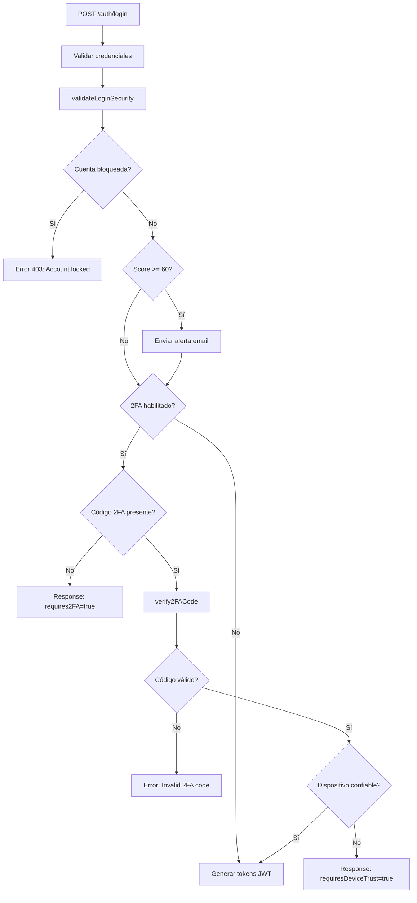

# ✅ Fase 3: Multi-Factor Authentication & Advanced Security - COMPLETADA

## 📋 Resumen
Implementación completa de autenticación de dos factores (2FA/TOTP), gestión de dispositivos confiables, análisis de seguridad basado en riesgo, y detección de actividad sospechosa.

---

## 🔐 1. Autenticación de Dos Factores (2FA/TOTP)

### Tecnología
- **speakeasy v2** - Generación y verificación de códigos TOTP
- **qrcode** - Generación de códigos QR para apps de autenticación

### Características
- ✅ Generación de secretos TOTP con códigos QR
- ✅ Verificación de códigos de 6 dígitos con ventana de 60 segundos (window=2)
- ✅ 10 códigos de respaldo (backup codes) de 8 caracteres hexadecimales
- ✅ Códigos de respaldo hasheados con SHA256 y de uso único
- ✅ Habilitar/deshabilitar 2FA con verificación obligatoria
- ✅ Regeneración de códigos de respaldo
- ✅ Integración en flujo de login

### Endpoints

#### POST `/two-factor/generate`
Genera un nuevo secreto TOTP y código QR.
```json
Response: {
  "secret": "BASE32STRING",
  "qrCodeUrl": "otpauth://totp/...",
  "qrCodeImage": "data:image/png;base64,..."
}
```

#### POST `/two-factor/enable`
Habilita 2FA después de verificar código TOTP.
```json
Request: { "token": "123456" }
Response: {
  "enabled": true,
  "backupCodes": ["8f3a2d1c", "4b7e9f2a", ...]
}
```

#### POST `/two-factor/verify`
Verifica un código TOTP o de respaldo.
```json
Request: { "code": "123456" }
Response: { "verified": true }
```

#### POST `/two-factor/disable`
Deshabilita 2FA con verificación.
```json
Request: { "token": "123456" }
Response: { "disabled": true }
```

#### POST `/two-factor/backup-codes/regenerate`
Genera nuevos códigos de respaldo.
```json
Request: { "token": "123456" }
Response: {
  "backupCodes": ["a1b2c3d4", "5e6f7g8h", ...]
}
```

#### GET `/two-factor/status`
Obtiene estado de 2FA del usuario.
```json
Response: {
  "enabled": true,
  "backupCodesRemaining": 8
}
```

### Archivos
- `/src/modules/two-factor/two-factor.service.ts` - Lógica de TOTP (256 líneas)
- `/src/modules/two-factor/two-factor.controller.ts` - 6 endpoints
- `/src/modules/two-factor/two-factor.module.ts` - Módulo con User schema

---

## 📱 2. Gestión de Dispositivos Confiables

### Tecnología
- **ua-parser-js** - Parsing de user agents para identificar dispositivos
- **Cookies httpOnly** - Cookie `remember_device` con expiración de 30 días

### Características
- ✅ Fingerprinting de dispositivos (IP + user agent hash)
- ✅ Tokens únicos para cada dispositivo confiable
- ✅ Expiración automática después de 30 días (TTL index en MongoDB)
- ✅ Listado de dispositivos activos con información de ubicación
- ✅ Revocación individual o masiva de dispositivos
- ✅ Alertas por email al confiar en nuevo dispositivo
- ✅ Bypass de 2FA para dispositivos confiables

### Endpoints

#### POST `/devices/trust`
Marca el dispositivo actual como confiable.
```json
Response: {
  "deviceId": "ObjectId",
  "expiresAt": "2025-02-15T...",
  "message": "Device trusted for 30 days"
}
// Sets cookie: remember_device=TOKEN; HttpOnly; Max-Age=2592000
```

#### GET `/devices`
Lista todos los dispositivos confiables del usuario.
```json
Response: [
  {
    "_id": "ObjectId",
    "deviceType": "desktop",
    "browser": "Chrome 120",
    "os": "Windows 10",
    "city": "Lima",
    "country": "Peru",
    "lastUsed": "2025-01-16T...",
    "expiresAt": "2025-02-15T..."
  }
]
```

#### DELETE `/devices/:deviceId`
Revoca un dispositivo específico.
```json
Response: { "revoked": true }
```

#### DELETE `/devices`
Revoca todos los dispositivos del usuario.
```json
Response: { "revokedCount": 3 }
```

### Schema: TrustedDevice
```typescript
{
  userId: ObjectId,
  deviceFingerprint: string (indexed),
  rememberToken: string (unique, indexed),
  deviceType: 'mobile' | 'tablet' | 'desktop',
  browser: string,
  os: string,
  lastUsed: Date,
  ipAddress: string,
  location?: GeoLocation,
  city?: string,
  country?: string,
  expiresAt: Date
}
// TTL Index: expiresAt (auto-delete after 30 days)
```

### Archivos
- `/src/modules/devices/entities/trusted-device.schema.ts` - Schema con TTL
- `/src/modules/devices/device.service.ts` - Gestión de dispositivos (216 líneas)
- `/src/modules/devices/device.controller.ts` - 4 endpoints
- `/src/modules/devices/device.module.ts` - Módulo con TrustedDevice schema

---

## 🌍 3. Geolocalización y Análisis de Ubicaciones

### Tecnología
- **ip-api.com** - API gratuita de geolocalización (45 requests/minuto)
- **Fórmula de Haversine** - Cálculo de distancia entre coordenadas GPS

### Características
- ✅ Lookup de ubicación por IP con caché de 24 horas
- ✅ Cálculo de distancia entre ubicaciones (km)
- ✅ Detección de ubicaciones sospechosas (>500km de distancia)
- ✅ Manejo de IPs privadas (localhost, LAN)
- ✅ Rate limiting respetado (45 req/min)

### API Response
```json
{
  "city": "Lima",
  "country": "Peru",
  "countryCode": "PE",
  "lat": -12.0464,
  "lon": -77.0428,
  "timezone": "America/Lima",
  "isp": "Telefonica del Peru"
}
```

### Métodos Clave
- `getLocation(ip: string): Promise<GeoLocation>` - Obtiene datos de IP
- `calculateDistance(lat1, lon1, lat2, lon2): number` - Distancia en km
- `isSuspiciousLocation(userId, currentLoc): boolean` - Detecta anomalías

### Archivos
- `/src/modules/security/geolocation.service.ts` - Servicio de geolocalización (138 líneas)

---

## 🛡️ 4. Análisis de Seguridad y Riesgo

### Sistema de Scoring (0-100)
| Factor | Puntos | Descripción |
|--------|--------|-------------|
| Nueva IP | +20 | Primera vez desde esta IP |
| Ubicación sospechosa | +30 | >500km de última ubicación |
| Intentos rápidos | +25 | 3+ intentos en 5 minutos |
| **TOTAL** | **0-100** | |

### Thresholds de Acción
- **Score < 60**: Login permitido, registro normal
- **Score >= 60**: Requiere verificación adicional (2FA obligatorio, alerta por email)
- **Score >= 80**: Cuenta bloqueada temporalmente (30 minutos)

### Características
- ✅ Análisis en tiempo real en cada intento de login
- ✅ Detección de nuevas IPs
- ✅ Detección de ubicaciones anómalas
- ✅ Detección de patrones de intentos rápidos
- ✅ Bloqueo temporal de cuenta con `lockUntil`
- ✅ Registro de eventos de seguridad con severidad
- ✅ Alertas por email para eventos críticos
- ✅ TTL de 90 días para eventos de seguridad

### Tipos de Eventos
```typescript
enum SecurityEventType {
  SUSPICIOUS_LOGIN = 'suspicious_login',
  NEW_LOCATION = 'new_location',
  NEW_IP = 'new_ip',
  NEW_DEVICE = 'new_device',
  FAILED_2FA = 'failed_2fa',
  ACCOUNT_LOCKED = 'account_locked',
  PASSWORD_CHANGED = 'password_changed'
}

enum Severity {
  LOW = 'low',
  MEDIUM = 'medium',
  HIGH = 'high',
  CRITICAL = 'critical'
}
```

### Endpoints

#### GET `/security/events`
Lista eventos de seguridad del usuario (últimos 30 días).
```json
Response: [
  {
    "_id": "ObjectId",
    "eventType": "new_ip",
    "severity": "medium",
    "riskScore": 20,
    "ipAddress": "203.45.67.89",
    "location": { "city": "Lima", "country": "Peru" },
    "metadata": { "previousIp": "192.168.1.100" },
    "actionTaken": "email_alert_sent",
    "createdAt": "2025-01-16T..."
  }
]
```

#### GET `/security/stats` (Admin only)
Estadísticas de seguridad del sistema.
```json
Response: {
  "totalEvents": 156,
  "criticalEvents": 3,
  "accountsLocked": 2,
  "eventsByType": {
    "suspicious_login": 45,
    "new_ip": 67,
    "new_location": 31,
    "failed_2fa": 13
  }
}
```

### Schema: SecurityEvent
```typescript
{
  userId: ObjectId,
  eventType: SecurityEventType,
  severity: Severity,
  riskScore: number (0-100),
  ipAddress: string,
  userAgent?: string,
  location?: GeoLocation,
  metadata?: any,
  actionTaken?: string,
  reviewed: boolean (default: false),
  reviewedBy?: ObjectId,
  reviewedAt?: Date
}
// TTL Index: createdAt (auto-delete after 90 days)
```

### Archivos
- `/src/modules/security/entities/security-event.schema.ts` - Schema con TTL
- `/src/modules/security/security.service.ts` - Análisis de riesgo (320 líneas)
- `/src/modules/security/security.controller.ts` - 2 endpoints
- `/src/modules/security/security.module.ts` - Módulo de seguridad

---

## 🔄 5. Integración con Flujo de Login

### Flujo Actualizado


### Cambios en Archivos Existentes

#### `auth.service.ts`
- Agregados servicios: `TwoFactorService`, `DeviceService`, `SecurityService`
- Nuevo método: `validateLoginSecurity()` - Análisis de riesgo pre-login
- Nuevo método: `verify2FACode()` - Validación de TOTP/backup

#### `auth.controller.ts`
- Actualizado método `login()`:
  1. Autenticar credenciales (LocalAuthGuard)
  2. Llamar `validateLoginSecurity()` - análisis de riesgo
  3. Si bloqueado: retornar error con alertas
  4. Si `requires2FA` y sin código: retornar `requires2FA=true`
  5. Si tiene código: verificar con `verify2FACode()`
  6. Proceder con generación de tokens
- Lee cookie `remember_device` para verificar dispositivo confiable

#### `login.dto.ts`
- Agregado campo opcional: `twoFactorCode?: string`
- Validadores: `@IsOptional()`, `@IsString()`

#### `app.module.ts`
- Agregados módulos: `TwoFactorModule`, `DeviceModule`, `SecurityModule`

---

## 📦 Dependencias Instaladas

```json
{
  "dependencies": {
    "speakeasy": "^2.0.0",
    "qrcode": "^1.5.3",
    "ua-parser-js": "^1.0.37",
    "@nestjs/axios": "^3.0.1",
    "axios": "^1.6.5"
  },
  "devDependencies": {
    "@types/speakeasy": "^2.0.10",
    "@types/qrcode": "^1.5.5",
    "@types/ua-parser-js": "^0.7.39"
  }
}
```

---

## 🗂️ Estructura de Archivos Creados

```
Backend/src/modules/
├── two-factor/
│   ├── two-factor.service.ts       (256 líneas)
│   ├── two-factor.controller.ts    (6 endpoints)
│   └── two-factor.module.ts
├── devices/
│   ├── entities/
│   │   └── trusted-device.schema.ts (TTL: 30 días)
│   ├── device.service.ts            (216 líneas)
│   ├── device.controller.ts         (4 endpoints)
│   └── device.module.ts
└── security/
    ├── entities/
    │   └── security-event.schema.ts (TTL: 90 días)
    ├── geolocation.service.ts       (138 líneas)
    ├── security.service.ts          (320 líneas)
    ├── security.controller.ts       (2 endpoints)
    └── security.module.ts
```

**Total**: 15+ archivos nuevos, 5 archivos modificados

---

## 🧪 Testing Manual

### 1. Test 2FA Flow
```bash
# 1. Generar secreto TOTP
POST /two-factor/generate
# → Escanear QR con Google Authenticator

# 2. Habilitar 2FA
POST /two-factor/enable
Body: { "token": "123456" }
# → Guardar backup codes

# 3. Login con 2FA
POST /auth/login
Body: { "email": "user@example.com", "password": "pass" }
# → Response: { "requires2FA": true }

POST /auth/login
Body: { "email": "user@example.com", "password": "pass", "twoFactorCode": "123456" }
# → Response: { "access_token": "...", "refresh_token": "..." }
```

### 2. Test Trusted Device
```bash
# 1. Confiar dispositivo
POST /devices/trust
# → Cookie: remember_device=TOKEN (30 días)

# 2. Login en mismo dispositivo
POST /auth/login
Body: { "email": "user@example.com", "password": "pass" }
# → Sin 2FA si dispositivo confiable

# 3. Listar dispositivos
GET /devices

# 4. Revocar dispositivo
DELETE /devices/:deviceId
```

### 3. Test Security Analysis
```bash
# 1. Login desde nueva IP
POST /auth/login (desde IP diferente)
# → Email alert enviado
# → Response: { "requires2FA": true, "alerts": ["New IP detected"] }

# 2. Login desde ubicación lejana
POST /auth/login (desde país diferente)
# → Risk score aumenta (+30 puntos)

# 3. Múltiples intentos rápidos
POST /auth/login (3+ intentos en 5 min)
# → Account locked (30 min)
```

---

## 🔒 Consideraciones de Seguridad

### Implementadas ✅
- Códigos de respaldo hasheados con SHA256
- Cookies httpOnly para remember_device
- TOTP con window=2 (60s de tolerancia)
- TTL automático en MongoDB (30/90 días)
- Rate limiting en ip-api.com (45 req/min)
- Validación de dispositivos en cada login
- Alertas por email para eventos críticos
- Bloqueo temporal de cuentas

### Recomendaciones Adicionales
- [ ] Implementar MessageBird para SMS/WhatsApp como fallback 2FA
- [ ] Agregar CAPTCHA en formularios de login (ya implementado en frontend)
- [ ] Rate limiting adicional para endpoints de 2FA
- [ ] Logs de auditoría para acciones admin (ya implementado en Fase 2)
- [ ] Backup periódico de trusted devices
- [ ] Dashboard admin para revisar eventos de seguridad

---

## 📚 Recursos API Externa

### ip-api.com
- **URL**: `http://ip-api.com/json/{ip}`
- **Rate Limit**: 45 requests/minute (free tier)
- **Caché**: 24 horas en memoria
- **Campos**: city, country, countryCode, lat, lon, timezone, isp
- **Documentación**: https://ip-api.com/docs

---

## 🎯 Estado de Fases

| Fase | Descripción | Estado | Progreso |
|------|-------------|--------|----------|
| Fase 1 | Autenticación JWT (RS256) + CSRF + Redis | ✅ Completa | 100% |
| Fase 2 | Rate Limiting + Email Queues + Audit | ✅ Completa | 100% |
| **Fase 3** | **2FA + Trusted Devices + Security Analysis** | ✅ **Completa** | **100%** |

---

## ✅ Checklist Final

- [x] TwoFactorService con speakeasy
- [x] QR code generation con qrcode
- [x] 10 códigos de respaldo (8 chars hex)
- [x] TwoFactorController con 6 endpoints
- [x] TrustedDevice schema con TTL 30 días
- [x] DeviceService con trust management
- [x] DeviceController con remember_device cookie
- [x] GeoLocationService con ip-api.com
- [x] SecurityEvent schema con TTL 90 días
- [x] SecurityService con risk scoring (0-100)
- [x] Thresholds: 60=alert, 80=lock
- [x] Integración en auth.service.ts
- [x] Integración en auth.controller.ts
- [x] LoginDto con twoFactorCode field
- [x] Módulos importados en app.module.ts
- [x] Compilación exitosa sin errores
- [x] Documentación completa

---

## 🚀 Próximos Pasos

### Inmediatos
1. **Testing funcional**: Probar flujos completos de 2FA, trusted devices y security
2. **Integración frontend**: Conectar con TwoFactorAuthSection.tsx y SessionManagementSection.tsx existentes
3. **Testing e2e**: Casos de borde y escenarios de ataque

### Opcionales (Fase 4)
1. **MessageBird SMS/WhatsApp**: Implementar webhook para 2FA por SMS
2. **Admin Dashboard**: Panel para revisar eventos de seguridad
3. **Biometric Auth**: WebAuthn/FIDO2 para autenticación sin contraseña
4. **Session Recording**: Grabación de sesiones para análisis forense

---

**Desarrollado por**: GitHub Copilot + Claude Sonnet 4.5  
**Fecha de completación**: 16 de enero de 2025  
**Compilación**: ✅ Exitosa (webpack 5.97.1)
